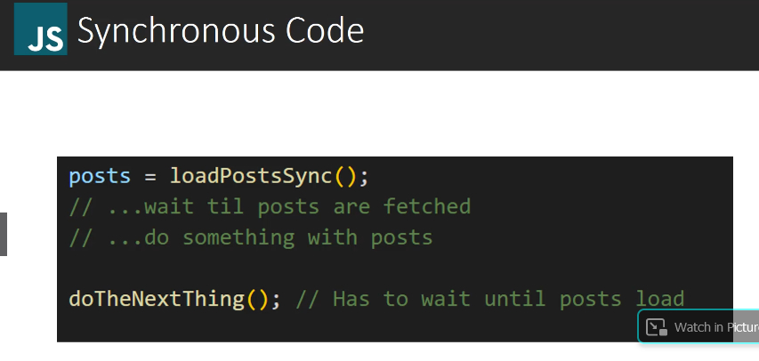
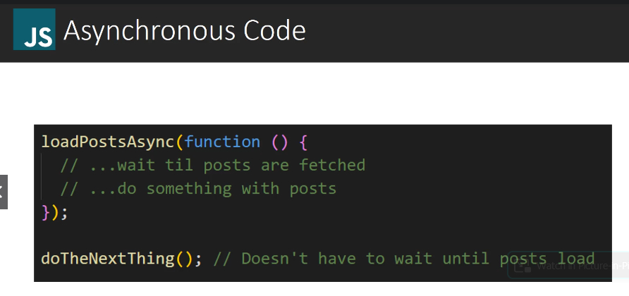
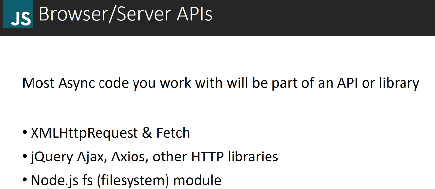
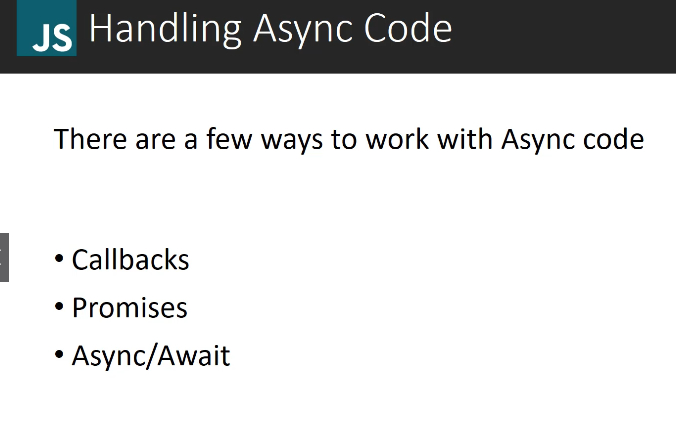
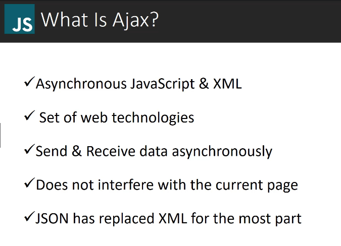
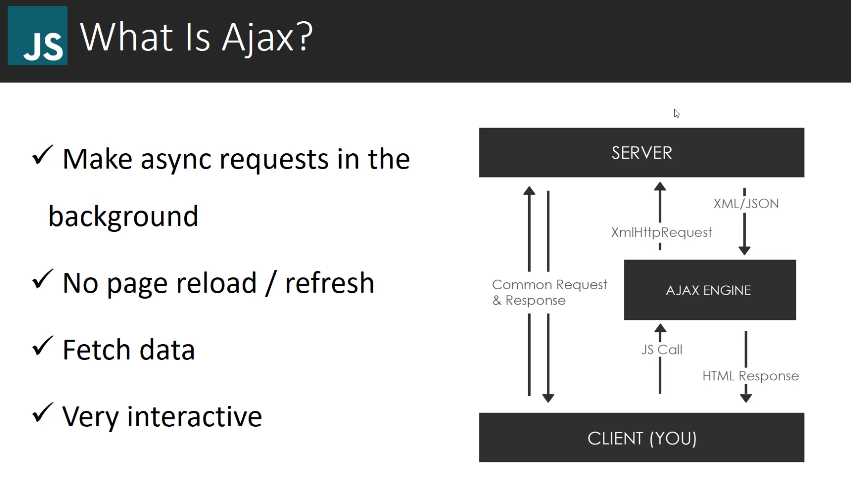
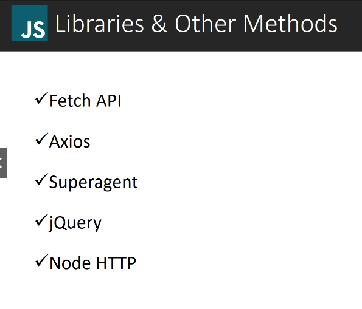

# What is Asynchronous Programming

Load post synchronously.
And let's say this function fetches posts from some server somewhere.
Now, we don't know how long it might take to get these posts.
It could be really slow. 
It could be a really slow network that we're getting them from low bandwidth.
Whatever the reason, it could take a few seconds or even more.
Now, in this way of writing this code, we're going to have to wait until the posts are fetched and
then do something with the post.
And then only after that's done can we move on to the do the next thing function.
So this is what's called blocking code.
It's going to block until the posts are fetched and loaded, which obviously slows things down.

In this case, instead of just pulling the post out of a synchronous function, we're passing in a callback function, which is just one method for handling asynchronous code. 
This callback will run and fetch the post and allow us to do something with the post, but `doTheNextThing()` function does not have to wait until the posts are fetched and loaded.
So the program isn't blocked and it will simply just keep going. Even if it takes a while for the post to be fetched.
It's not going to stop the do the next thing function from running. 
In turn, this is much faster.
And that's the beauty of asynchronous JavaScript in asynchronous programming in general.

 These are all async technologies, so you just have to handle the response in a certain way.

Ajax isn't a language or framework or a library.
It's a set of web technologies to send and receive data from the client and server.
And it does this asynchronously.
So it's done behind the scenes without having to explicitly reload the Web page.
Most of the APIs that you're going to work with return JSON data, not XML or in some cases they'll return both. 
Now, when we send and receive requests that can be from something  - on our local machine   - or on our local
server,   - or it can be something from a public API, something like Google Maps or the GitHub API.  
There's a lot of different whether APIs. 
There's tons of them out there.
Now, of course, these APIs have to have certain permissions granted for us to be able to use them. 
They usually have something called cores enabled, which allows for cross domain communication, meaning that we can make requests to their API, even though we're not on the same domain name as them.
Some APIs do require some kind of authentication.
Oath is very popular that that part can get really messy and it's beyond what we're going to be doing here.

Now there are other libraries and methods to use to make HTTP requests and fetch API is one of them.
That's actually part of the browser.
That's part of core JavaScript.
So we are going to get into the API, but then you have external libraries that you can use, like Axios
Superagent, J Query, which is a Dom manipulation library, node HTTP, if you're dealing with node js.  
It's up to you how you want to make your requests. Fetch is what I would suggest because it's, it's part of vanilla
JavaScript and it's a really nice API.
Ajax and XhR, which is what we're looking at now for the next few videos, is kind of an older technology,
but it's still very important to learn. 
After that, we'll look into fetch. Axios, superagent, these are really nice external libraries.
But of course you need to include them as an external script.
They're not part of your your core JavaScript. J query
I would not suggest using for Ajax because it's so bloated, it's a complete Dom manipulation library.And then you have node HTTP which is nice if you're using node js.

